  

  

  
  
  

---

### What I'm working on :)

**[CamEvents.org](https://camevents.org)** - Aggregates 25 sources of startup, innovation and research events across Cambridge into one filterable page. Zero cost, zero accounts reached 1000+ Users.

**[CozyGrids.com](https://cozygrids.com)** - Converts images into printable craft patterns (cross-stitch, knitting, diamond painting, crochet, embroidery) with a full editor and PDF/machine export. CIELAB colour science. Just launching...

**[PuzzleDojo](https://puzzle.chepaldin.com)** - Solves all 7 LinkedIn daily puzzles from a screenshot. Browser-side computer vision (OpenCV WASM), constraint propagation, Algorithm X, and BGE embeddings. 500+ tests.

---

###  Selected repos

| Repo | What it does |
|------|-------------|
| [puzzle-solvers](https://github.com/Hook12aaa/puzzle-solvers) | Solver, generator and web app for 7 LinkedIn puzzles - vision pipeline, constraint engines, DFS search |
| [json_parser](https://github.com/Hook12aaa/json_parser) | JSON repair for malformed LLM output - parallel processing, LRU caching |
| [personal](https://github.com/Hook12aaa/personal) | Portfolio site - custom React, particle animations, audience personalisation |
| [-market-trading-dashboard](https://github.com/Hook12aaa/-market-trading-dashboard) | Real-time forex monitoring with RSI, moving averages, position sizing |

### 🏆 Kaggle

| Repo | Approach |
|------|----------|
| [Kaggle_NFL](https://github.com/Hook12aaa/Kaggle_NFL) | NFL competition entry |
| [HF_kaggle](https://github.com/Hook12aaa/HF_kaggle) | XGBoost + CatBoost ensemble blending |
| [titanic_LightGBM_Bayesian](https://github.com/Hook12aaa/titanic_LightGBM_Bayesian) | LightGBM with Bayesian optimisation |

---

### Tech Stack

  

| | Technologies |
|---|---|
| **Languages** | Python, JavaScript, TypeScript, SQL |
| **AI / ML** | PyTorch, JAX, scikit-learn, XGBoost, LightGBM, CatBoost, spaCy, Ollama |
| **Web** | React, Next.js, Vite, Three.js, D3.js, Capacitor. Big fan of VITE! |
| **Backend** | FastAPI, MongoDB, Neo4j, HDF5 |
| **Infra** | Docker, Vercel |
| **Techniques** | LLM orchestration, knowledge graphs, embeddings (BGE, MPNet), TF-IDF, computer vision |

---

### GitHub Stats

  
  

  

---

### 🏢 Previously

**AstraZeneca** - joined at 18 on a degree apprenticeship. Built drones, IoT and computer vision PoCs. Consulted on AI workflows for global commercial teams. Lead multiple hackathons with Google, Microsoft, Nvidia & Intel. Core team on the Enterprise GenAI programme that trained 10,000+ employees - won multiple awards such as Gold awards at [The Learning Awards 2025](https://thelearningawards.com/). Scaled the TH!NK neurodiversity ERG from ~20 to 3,000+ members across 9 countries.

  

